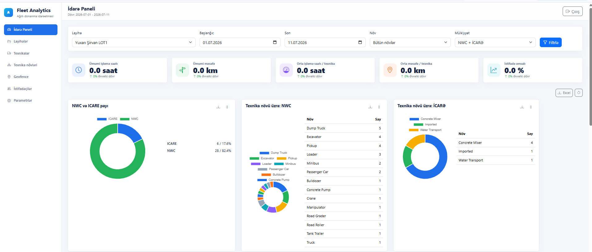
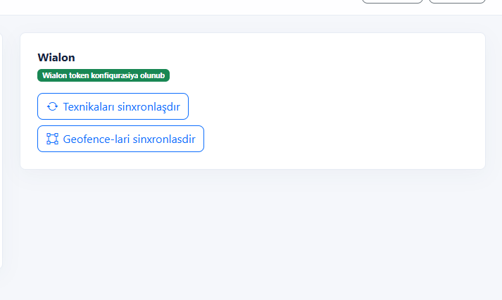
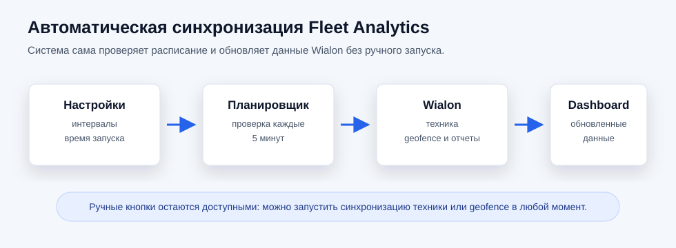

# Fleet Analytics: инструкция пользователя

Обновлено: 12.07.2026  
Адрес системы: [https://nwc-fleet-analytics.gpsaz.tech](https://nwc-fleet-analytics.gpsaz.tech)

Эта инструкция описывает основные действия в Fleet Analytics: просмотр dashboard, фильтрацию данных, экспорт в Excel, работу с проектами, пользователями и синхронизацией Wialon.

## 1. Вход в систему

1. Откройте сайт Fleet Analytics.
2. Введите email и пароль, выданные администратором.
3. Нажмите `Daxil ol` / `Войти`.

Если вход не выполняется, проверьте правильность email и пароля. При повторных ошибках обратитесь к администратору.

## 2. Главное меню

Слева находится основное меню:

| Раздел | Назначение |
| --- | --- |
| `İdarə Paneli` | Главный dashboard с аналитикой по технике |
| `Layihələr` | Проекты и привязки к группам Wialon |
| `Texnikalar` | Список техники |
| `Texnika növləri` | Типы техники |
| `Geofence` | Геозоны |
| `İstifadəçilər` | Пользователи и роли |
| `Parametrlər` | Настройки Wialon и синхронизации |

Верхняя панель содержит кнопку выхода и выбор языка.

## 3. Dashboard

Dashboard показывает аналитику по выбранному проекту, периоду, типу техники и принадлежности.

### Фильтры

В верхней части dashboard доступны фильтры:

| Фильтр | Что делает |
| --- | --- |
| `Layihə` | Выбор проекта |
| `Başlanğıc` | Дата начала |
| `Son` | Дата окончания |
| `Növ` | Тип техники |
| `Mülkiyyət` | `NWC`, `İCARƏ` или оба варианта |
| `Filtrlə` | Применить выбранные фильтры |

Также доступны быстрые периоды:

| Период | Назначение |
| --- | --- |
| `Bugün` | Сегодня |
| `Dünən` | Вчера |
| `Son 7 gün` | Последние 7 дней |
| `Bu ay` | Текущий месяц |
| `Keçən ay` | Прошлый месяц |
| `Fərdi interval` | Ручной выбор дат |

После нажатия `Filtrlə` система показывает экран загрузки с процентом выполнения. Это означает, что данные формируются из Wialon и локальной базы.

### Основные показатели

В верхних карточках dashboard отображаются:

| Показатель | Значение |
| --- | --- |
| `Ümumi işləmə saatı` | Суммарные моточасы |
| `Ümumi məsafə` | Суммарный пробег |
| `Orta işləmə saatı / texnika` | Средние моточасы на единицу техники |
| `Orta məsafə / texnika` | Средний пробег на единицу техники |
| `İstifadə əmsalı` | Коэффициент использования |

### Dashboard-блоки

В dashboard используются следующие блоки:

| Блок | Что показывает |
| --- | --- |
| `Project üzrə: NWC vs İCARƏ` | Сравнение работы собственной и арендной техники |
| `Texnika növü üzrə: NWC` | Распределение собственной техники по типам |
| `Texnika növü üzrə: İCARƏ` | Распределение арендной техники по типам |
| `Orta işləmə saatı və KM` | Средние моточасы и пробег |
| `Top 10 az işləyənlər` | 10 машин с минимальными моточасами |
| `Top 10 çox işləyənlər` | 10 машин с максимальными моточасами |
| `NWC və ICARE payı` | Доля NWC и аренды |
| `Geozonadan kənara çıxma hadisələri` | Выезды за пределы геозоны |
| `İstifadə əmsalı` | Динамика коэффициента использования |
| `Project üzrə faktiki işləmə saatı: NWC vs İCARƏ` | Категории фактического рабочего времени |

## 4. Экспорт в Excel

Для выгрузки данных используйте кнопку `Excel` или иконку скачивания внутри нужного блока.

Экспорт содержит:

1. выбранные фильтры;
2. название блока;
3. строки с техникой, проектом, принадлежностью, типом и расчетными значениями.

Файл скачивается в формате `.xlsx` и открывается в Microsoft Excel.

## 5. Перемещение блоков dashboard

У каждого dashboard-блока есть иконка перетаскивания. Чтобы изменить порядок:

1. Наведите курсор на блок.
2. Зажмите иконку перетаскивания.
3. Переместите блок в нужное место.
4. Отпустите кнопку мыши.

Порядок сохраняется в браузере пользователя. Если открыть систему в другом браузере или на другом компьютере, порядок может быть стандартным.

## 6. Проекты

Раздел `Layihələr` используется для управления проектами.

Для каждого проекта можно указать группы объектов Wialon:

| Группа | Назначение |
| --- | --- |
| `NWC` | Собственная техника компании |
| `İCARƏ` | Арендная техника |

Если у проекта есть geofence-группа Wialon, ее также нужно привязать к проекту. Это нужно для корректного блока `Geozonadan kənara çıxma hadisələri`.

При открытии dashboard отдельного проекта фильтр `project_id` применяется автоматически.

## 7. Техника и типы техники

Раздел `Texnikalar` показывает список техники, полученной из Wialon.

В карточке техники важны:

| Поле | Назначение |
| --- | --- |
| регистрационный номер | основной номер техники |
| Wialon unit ID | ID объекта Wialon |
| проект | текущая привязка к проекту |
| тип техники | используется в фильтрах и диаграммах |
| принадлежность | `NWC` или `İCARƏ` |

Раздел `Texnika növləri` используется для справочника типов техники: excavator, truck, loader и т.д.

## 8. Geofence

Раздел `Geofence` используется для списка геозон и контроля выхода техники за пределы зоны.

Блок `Geozonadan kənara çıxma hadisələri` на dashboard использует отчет Wialon и показывает:

| Поле | Назначение |
| --- | --- |
| техника | название или номер техники |
| статус / vendor | принадлежность или источник |
| часы вне геозоны | сколько времени техника была вне зоны |

## 9. Пользователи и роли

Раздел `İstifadəçilər` доступен администратору.

Роли:

| Роль | Доступ |
| --- | --- |
| `Admin` | Полный доступ: dashboard, справочники, пользователи, настройки |
| `Viewer` | Просмотр dashboard и отчетов без административных настроек |

При создании пользователя укажите:

1. имя;
2. email;
3. роль;
4. пароль;
5. статус `Aktiv`.

В системе должен оставаться минимум один активный администратор.

## 10. Язык интерфейса

В верхнем меню есть выбор языка:

| Язык | Назначение |
| --- | --- |
| `Azərbaycanca` | Азербайджанский |
| `Русский` | Русский |
| `English` | Английский |

После выбора языка интерфейс переключается сразу.

## 11. Синхронизация Wialon

Синхронизация нужна, чтобы Fleet Analytics получал актуальную технику, geofence и ежедневные показатели из Wialon.

### Ручная синхронизация

В разделе `Parametrlər` доступны кнопки:

| Кнопка | Что делает |
| --- | --- |
| `Texnikaları sinxronlaşdır` | Загружает и обновляет технику из Wialon |
| `Geofence-ləri sinxronlaşdır` | Загружает и обновляет geofence из Wialon |

Используйте ручную синхронизацию, если в Wialon только что добавили новую технику или изменили группы.

### Автоматическая синхронизация

Автоматическая синхронизация работает в фоне.

В настройках можно включить или отключить:

| Настройка | Рекомендуемое значение |
| --- | --- |
| общая автоматическая синхронизация | включено |
| синхронизация техники | 1 раз в час |
| синхронизация geofence | 1 раз в день |
| ежедневная статистика | включено |
| время запуска ежедневной статистики | `02:10` |
| сколько последних дней обновлять | `1` |

Статус последнего запуска отображается в таблице `Avtomatik sinxronizasiya statusu`.

## 12. Как правильно работать с данными

1. Выберите проект.
2. Выберите период.
3. При необходимости выберите тип техники.
4. Выберите принадлежность: `NWC`, `İCARƏ` или оба варианта.
5. Нажмите `Filtrlə`.
6. Дождитесь окончания загрузки.
7. Проверьте dashboard-блоки.
8. При необходимости скачайте Excel.

## 13. Частые ситуации

### Данные не появились после изменения в Wialon

Запустите ручную синхронизацию техники или geofence в разделе `Parametrlər`. Если данные все равно не появились, проверьте, находится ли объект в правильной группе Wialon.

### Dashboard долго загружается

Большой период дат может формироваться несколько минут, особенно если используется отчет Wialon. Для быстрой проверки сначала выберите один день или `Son 7 gün`.

### В проекте не видно арендную или собственную технику

Проверьте, что в проекте привязаны обе группы Wialon:

1. группа `NWC`;
2. группа `İCARƏ`.

Если у проекта есть только одна группа, dashboard покажет только эту часть.

### Excel нужен только по одному блоку

Используйте иконку скачивания внутри нужного dashboard-блока. Так файл будет содержать данные только этого блока.

## 14. Безопасность

1. Не передавайте свой пароль другим пользователям.
2. Не храните Wialon token в переписке или открытых документах.
3. Для нового сотрудника создавайте отдельного пользователя.
4. Если сотрудник больше не должен иметь доступ, отключите его пользователя или удалите учетную запись.
5. Для просмотра без редактирования используйте роль `Viewer`.
